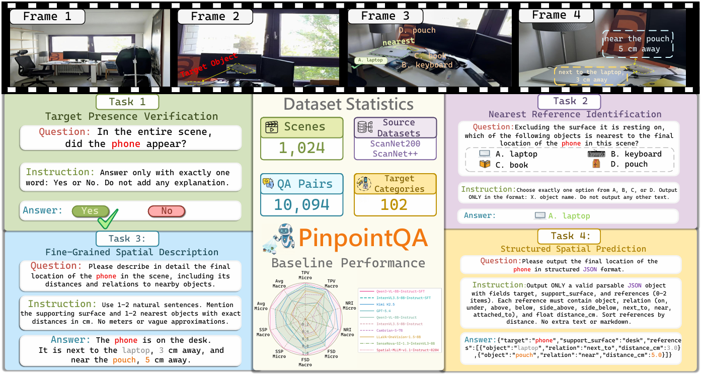

<h1 align="center">PinpointQA: A Dataset and Benchmark for Small Object-Centric Spatial Understanding in Indoor Videos</h1>

<p align="center">
  <a href="https://rainchowz.github.io/PinpointQA/">
    
  </a>
  <a href="https://huggingface.co/datasets/RainChow/PinpointQA">
    
  </a>
</p>

<p align="center">
  
</p>

<p align="center">
  <em>
    PinpointQA is a dataset and benchmark for small object-centric spatial understanding in indoor videos,
    with four tasks covering target presence verification, nearest reference identification,
    fine-grained spatial description, and structured spatial prediction.
  </em>
</p>

> **Important:** This repository releases **benchmark annotations** and **intermediate spatial representations** only. It does **not** redistribute the original scene assets or converted video files. Please refer to the **Source Data Preparation** section in the [Hugging Face dataset card](https://huggingface.co/datasets/RainChow/PinpointQA) for details on obtaining the source assets and preparing local videos for reproduction.

## 🧭 Overview

**PinpointQA** is a dataset and benchmark for evaluating whether multimodal models can determine whether a specified small object appears in an indoor scene, localize it through nearby references, describe its final location precisely in natural language, and express the same grounded information in a form useful to both humans and downstream systems.

The benchmark contains four tasks:
- **TPV**: Target Presence Verification
- **NRI**: Nearest Reference Identification
- **FSD**: Fine-Grained Spatial Description
- **SSP**: Structured Spatial Prediction

This repository contains the **evaluation code**, **prompt template**, and **utility scripts** used in the PinpointQA project.

## 📰 News

- **Apr 1, 2026**: We released the PinpointQA dataset and the corresponding evaluation code.🔥

## 📂 Repository Structure

```text
PinpointQA/
├── assets/
│   └── Overview.png
├── tools/
│   ├── convert_mkv_to_mp4.py
│   ├── convert_sens_to_mp4.py
│   └── convert_test_jsonl_to_gt_dir.py
├── eval.py
├── eval_utils/
│   ├── constants.py
│   ├── benchmark.py
│   ├── scoring.py
│   ├── reporting.py
│   ├── task3_judge.py
│   └── ...
├── eval_prompt.txt
├── LICENSE
└── README.md
```

## ⚙️ Evaluation

### 1. Environment Setup

The evaluation code depends only on the Python standard library and the OpenAI SDK, which is required by the current implementation for **FSD** scoring.

```bash
pip install openai
```

Task 3 (**FSD**) uses an OpenAI judge model, so you also need an API key:

```bash
export OPENAI_API_KEY=YOUR_OPENAI_API_KEY
```

On Windows PowerShell:

```powershell
$env:OPENAI_API_KEY="YOUR_OPENAI_API_KEY"
```

> **Note:** In the current implementation, `eval.py` initializes the FSD judge at startup, so `openai` and `OPENAI_API_KEY` are required for the full evaluation script.

### 2. Evaluation Workflow

The recommended workflow is:

1. Download the released `test.jsonl` from Hugging Face.
2. Convert `test.jsonl` into scene-level ground-truth JSON files.
3. Organize your model predictions as one JSON file per scene.
4. Run `eval.py`.

### 3. Convert `test.jsonl` to `gt_dir`

The released dataset on Hugging Face is distributed in JSONL format, while the evaluator expects **scene-level GT JSON files**. We therefore provide a conversion script.

```bash
python tools/convert_test_jsonl_to_gt_dir.py \
  --input_jsonl /path/to/test.jsonl \
  --output_dir /path/to/gt_dir \
  --overwrite
```

After conversion, `gt_dir` should look like this:

```text
gt_dir/
├── scene0000_00.json
├── scene0001_00.json
└── ...
```

Each GT file follows the evaluator's expected format, i.e. a top-level JSON object containing a `qa_pairs` list.

### 4. Prepare Predictions

The evaluator expects **one prediction JSON file per scene**, named as `<scene_name>.json`.

A recommended layout is:

```text
project_root/
├── eval.py
├── eval_prompt.txt
├── gt_dir/
│   ├── scene0000_00.json
│   ├── scene0001_00.json
│   └── ...
├── pred_dir/
│   ├── scene0000_00.json
│   ├── scene0001_00.json
│   └── ...
└── outputs/
```

Each prediction file should contain a top-level `qa_pairs` list. The evaluator matches GT and predictions by:

- **scene file name**
- **sample `id` inside `qa_pairs`**

#### Prediction file example

```json
{
  "dataset_info": {
    "model": "your_model_name"
  },
  "qa_pairs": [
    {
      "id": "scene0000_00_task1_0001",
      "question_type": "presence",
      "model_outputs": "Yes"
    }
  ]
}
```

### 5. Run Evaluation

#### Usage

```bash
python eval.py \
  --gt_dir /path/to/gt_dir \
  --pred_dir /path/to/pred_dir \
  --output_dir /path/to/output_dir \
  --eval_prompt ./eval_prompt.txt \
  --openai_api_key YOUR_OPENAI_API_KEY
```

If `OPENAI_API_KEY` is already set in your environment, you can omit `--openai_api_key`.


### 6. Output Files

The evaluator writes:

```text
output_dir/
├── results.jsonl
├── summary.json
└── per_scene_scores/
    ├── scene0000_00.json
    ├── scene0001_00.json
    └── ...
```

- `results.jsonl`: item-level evaluation records
- `summary.json`: compact overall summary, including micro and macro averages
- `per_scene_scores/`: one score file per scene

### 7. Scoring Summary

- **TPV**: exact-match yes/no scoring
- **NRI**: exact-match option-letter scoring
- **FSD**: LLM-as-a-judge scoring with the provided prompt template
- **SSP**: programmatic soft scoring over support surface, object identity, relation, and distance

## 🧰 Video Preparation Tools

The source assets from ScanNet++ and ScanNet v2 / ScanNet200 are not distributed as ready-to-use MP4 videos. For convenience, we provide:

- `tools/convert_mkv_to_mp4.py`
- `tools/convert_sens_to_mp4.py`

These scripts help convert source recordings into standard MP4 videos for downstream inference and evaluation pipelines.

## 📚 Citation

If you find PinpointQA useful, please cite:

```bibtex
@misc{zhou2026pinpointqa,
  title={PinpointQA: A Dataset and Benchmark for Small Object-Centric Spatial Understanding in Indoor Videos},
  author={Zhiyu Zhou and Peilin Liu and Ruoxuan Zhang and Luyang Zhang and Cheng Zhang and Hongxia Xie and Wen-Huang Cheng},
  year={2026}
}
```
